## Overview {.center}

Three new developments that make statistical visualisation tackle contemporary ideals.

<br>

1. **Uncertainty** — showing what we don't know (`ggdibbler`)
2. **Model diagnostics** — automating the reading of residual plots (`nullabor` / `autovi`)
3. **High dimensions** — seeing beyond two variables (`tourr` / `mulgar`)

## Preamble {.center background-color="#2c3e50"}

Doing research reproducibly

- literate programming, e.g. quarto documents, where code and text live together. Avoids cut and paste and mistakes made by forgetting to update if parameters or data change.
- version control, e.g. GitHub, to fully track changes to the work, able to back-track, branch

<br> 

See the link at the bottom of these slides for resources to reproduce this talk.

## Part 1 {.center background-color="#2c3e50"}

:::: {.columns}
::: {.column}

<br><br>
Visualising Uncertainty with `ggdibbler`

[*Harriet Mason's PhD research*](https://harriet-mason.github.io/phd_thesis/)
:::
::: {.column}
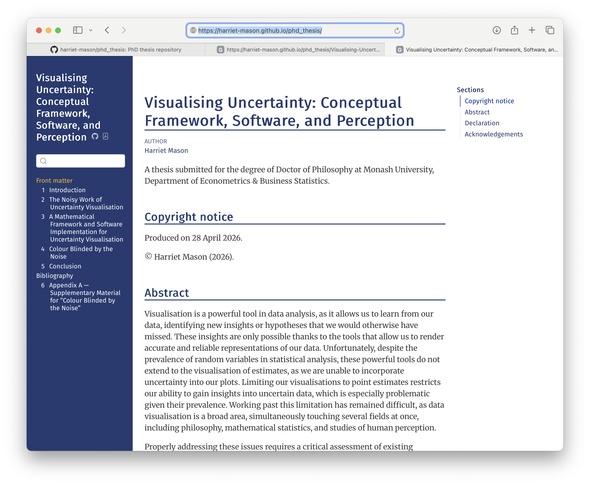
:::
::::

## The problem: the ways that we typically display uncertainty, or not


```{r}
#| label: tile-common
library(tibble)
library(dplyr)
library(ggplot2)
library(scales)
library(colorspace)
library(sf)
library(ggthemes)
set.seed(416)
d <- tibble(x = rep(c("A1", "A2", "A3"), 4), 
            y = rep(c("B1", "B2", "B3", "B4"), c(3, 3, 3, 3)),
            v = sort(runif(12, 65, 68)))
d_plt1 <- ggplot(d, aes(x = x, y = y, fill = v)) +
  geom_tile() +
  scale_fill_continuous_divergingx(palette = "Zissou 1", mid=66.5) +
  xlab("") + ylab("") +
  ggtitle("No uncertainty shown") +
  theme_minimal() +
  theme(legend.position = "none", 
    axis.text = element_text(size = 20),
    title = element_text(size=20))
d_plt1 + geom_text(aes(x = x, y = y, label = number(v, accuracy = 0.1)), size=8) 
```

<br>

> When uncertainty is invisible, decisions look more confident than they are.

::: {.notes}
Think about every bar chart, scatter plot, or map you've seen in a business report. The bars have crisp tops. The dots are exact. But behind every one of those values there is variability — measurement error, model uncertainty, sampling variation. We almost never show it.
:::

---

## `ggdibbler`: distributions as data

Replace a fixed value with a **distribution** — the plot does the rest.

```{r}
#| label: tile-uncertain
#| fig-width: 16
#| fig-height: 4
#| out-width: 100%
library(ggdibbler)
library(distributional)
library(patchwork)

d_uncertain_lo <- d |>
  group_by(x, y) |>
  mutate(est = dist_normal(v, runif(1, 0.5, 1.5))) |>
  ungroup() 

d_plt2 <- ggplot(d_uncertain_lo, aes(x = x, y = y, fill = est)) +
    geom_tile_sample() + # same syntax, uncertain output
    scale_fill_continuous_divergingx(palette = "Zissou 1", mid=66.5) +
    xlab("") + ylab("") +
    ggtitle("Low uncertainty") +
    theme_minimal() +
    theme(legend.position = "none", 
    axis.text = element_text(size = 20),
    title = element_text(size=20))  

d_uncertain_hi <- d |>
  group_by(x, y) |>
  mutate(est = dist_normal(v, runif(1, 0.5, 10.5))) |>
  ungroup() 

d_plt3 <- ggplot(d_uncertain_hi, aes(x = x, y = y, fill = est)) +
    geom_tile_sample() + # same syntax, uncertain output
    scale_fill_continuous_divergingx(palette = "Zissou 1", mid=66.5) +
    xlab("") + ylab("") +
    ggtitle("High uncertainty") +
    theme_minimal() +
    theme(legend.position = "none", 
      axis.text = element_text(size = 20),
      title = element_text(size=20))

d_plt1 + d_plt2 + d_plt3     
```

- Works with **any** `ggplot2` geom via `geom_*_sample()`
- Accepts continuous, discrete, spatial (`sf`), and mixed distributions
- Uses the `distributional` package — normal, empirical, truncated, mixed
- No new syntax to learn beyond replacing the variable


::: {.notes}
The key insight is elegantly simple. ggplot2 expects data. ggdibbler lets you pass a distribution instead of a number, and samples from it to show you the range of plausible visualisations. You see not one chart but an ensemble — and that ensemble tells a very different story than the crisp single-value version.
:::

---

## Philosophical foundation

`ggdibbler`'s philosophy: uncertainty visualisation should 

- *enhance* statistically significant signals to reinforce confidence 
- *suppress* apparent signals that spurious.

We call this "**signal modulation**". 

Don't treat noise as a separate signal (two variables, signal + noise) or a statistic. Visualise noise and signal 
together as a “**single integrated uncertain value**”. 

<br>

*The visualisation should express the uncertainty without additional cognitive load.*

<br><br><br>

::: {style="font-size: 70%;"}
Read more at [Mason et al (2026) "The Noisy Work of
Uncertainty Visualisation"](https://doi.org/10.48550/arXiv.2411.10482)
:::


## Software: `ggdibbler`


- Drop-in replacement for `ggplot2` 
- Applicable to estimates, predictions, bounded measurements, and more

::: {style="font-size: 70%;"}
Read more at [the ggdibbler website](https://harriet-mason.github.io/ggdibbler/)
:::

::: {style="position: absolute; top: 10px; right: 10px;"}
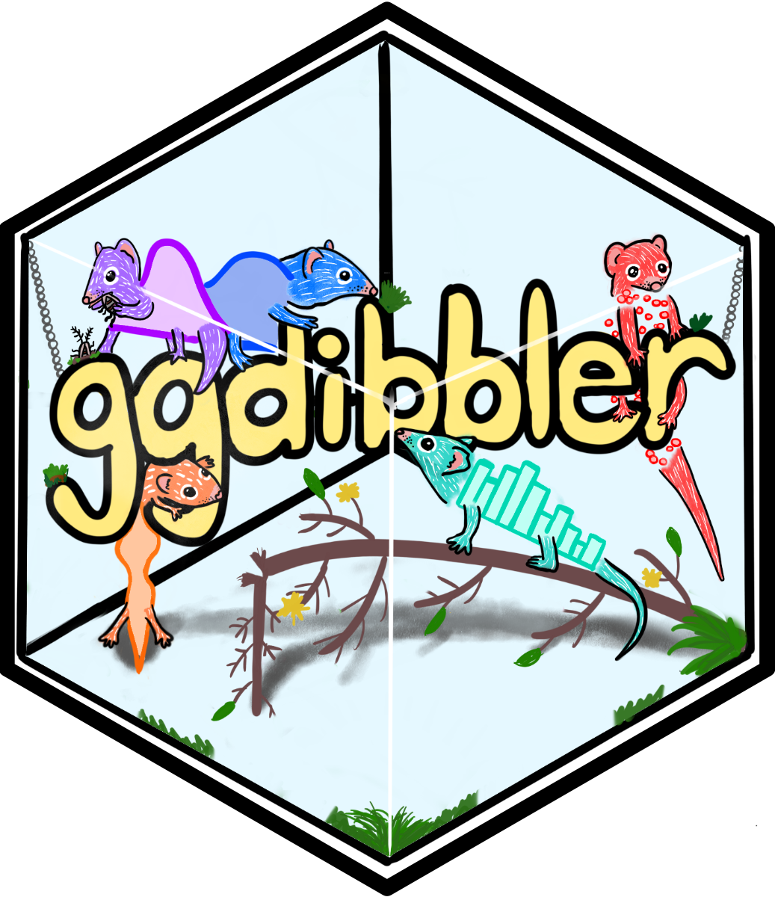{width=250px}
:::

::: {.panel-tabset}

## histogram

```{r}
#| label: histogram
#| fig-width: 12
#| fig-height: 4
#| out-width: 80%
#| fig-align: center
hp1 <- ggplot(mpg, aes(class)) + 
  geom_bar_sample(aes(fill = drv), 
                  position = "stack") +
  scale_fill_discrete_divergingx(palette = "Zissou 1", nmax = 8, order = c(1,4,7)) +
  theme_minimal() +
  theme(legend.position="none")+
  ggtitle("stack")


hp2 <- ggplot(uncertain_mpg, aes(class)) + 
  geom_bar_sample(aes(fill = drv), alpha=0.15,
                  position = "stack_identity")+
  scale_fill_discrete_divergingx(palette = "Zissou 1", nmax = 8, order = c(1,4,7)) +
  theme_minimal() +
  theme(legend.position="none")+
  ggtitle("stack_identity")

hp3 <- ggplot(uncertain_mpg, aes(class)) + 
  geom_bar_sample(aes(fill = drv),
                  position = "stack_dodge")+
  scale_fill_discrete_divergingx(palette = "Zissou 1", nmax = 8, order = c(1,4,7)) +
  theme_minimal() +
  theme(legend.position="none")+
  ggtitle("stack_dodge")

hp1 + hp2 + hp3
```

## pie

```{r}
#| label: pie
#| fig-width: 8
#| fig-height: 4
#| out-width: 60%
#| fig-align: center

ppie1 <- ggplot(mpg) +
  geom_bar(aes(x = factor(1), fill = class), 
                width = 1) +
  theme_void() +
  scale_fill_gdocs() +
  coord_polar(theta = "y") +
  ggtitle("ggplot") +
  theme(legend.position="none",
        aspect.ratio=1)

ppie2 <- ggplot(uncertain_mpg, aes(x="")) +
  geom_bar_sample(aes(fill = class), times = 50, alpha=1.2/50,
                  position = "stack_identity",
                  width = 1)+
  theme_void() +
  scale_fill_gdocs() +
  coord_polar(theta = "y") +
  ggtitle("ggdibbler") +
  theme(legend.position="none",
        aspect.ratio=1)

ppie1 + ppie2
```

## density2d

```{r}
#| label: density
#| fig-width: 12
#| fig-height: 4
#| out-width: 80%
#| fig-align: center
dp1 <- ggplot(faithfuld, aes(waiting, eruptions)) + 
  geom_raster(aes(fill = density)) +
  scale_fill_continuous_sequential(palette = "Viridis", rev=FALSE) +
  ggtitle("ggplot2") +
  theme_void() +
  theme(legend.position = "none")

dp2 <- ggplot(uncertain_faithfuld, aes(waiting, eruptions)) + 
  geom_raster_sample(aes(fill = density)) +
  scale_fill_continuous_sequential(palette = "Viridis", rev=FALSE) +
  ggtitle("ggdibbler some error")+
  theme_void() +
  theme(legend.position = "none")

dp3 <- ggplot(uncertain_faithfuld, aes(waiting, eruptions)) + 
  geom_raster_sample(aes(fill = density2)) +
  scale_fill_continuous_sequential(palette = "Viridis", rev=FALSE) +
  ggtitle("ggdibbler more error")+
  theme_void() +
  theme(legend.position = "none")

dp1  + dp2 + dp3
```

## maps

```{r}
#| label: maps
#| fig-width: 12
#| fig-height: 4
#| out-width: 80%
#| fig-align: center
# Make average summary of data
toy_temp_mean <- toy_temp |> 
  dplyr::group_by(county_name) |>
  summarise(temp_mean = mean(recorded_temp))

# plot it
mp1 <- ggplot(toy_temp_mean) +
  geom_sf(aes(geometry=county_geometry, fill=temp_mean), linewidth=0.7) +
  scale_fill_distiller(palette = "OrRd") +
  labs(fill="temp") +
  ggtitle("ggplot2") +
  theme_map() +
  theme(legend.position = "none")

# sample map
mp2 <- toy_temp_dist |> 
  ggplot() + 
  geom_sf_sample(aes(geometry = county_geometry, fill=temp_dist), linewidth=0, times=50) + 
  geom_sf(aes(geometry = county_geometry), fill=NA, linewidth=0.7) +
  scale_fill_distiller(palette = "OrRd") +
  labs(fill="temp") +
  ggtitle("ggdibbler")+
  theme_map() +
  theme(legend.position = "none")

mp1 + mp2
```

## regression

```{r}
#| label: regression
#| fig-width: 8
#| fig-height: 3
#| out-width: 80%
#| fig-align: center

rp <- ggplot(mtcars, aes(x=wt, y=mpg)) + 
  geom_point() + 
  theme_few() 

# ggplot, just error estimate
rp1 <- rp + 
  geom_abline(intercept = 37, slope = -5, colour = "#C30E62") 
# ggdibbler for coef AND standard error
rp2 <- rp + 
  geom_abline_sample(intercept = dist_normal(37, 1.8), 
                     slope = dist_normal(-5, 0.56),
                     times = 10, alpha = 0.8, 
                     colour = "#C30E62")
rp1 + rp2
```

:::

## Stepping backwards: grammar of graphics

The `ggplot2` package specifies a plot using a grammar, that maps variables from tidy data into plot elements.

This also provides a tight connection between the **plot and statistics**. 

:::: {.columns}
::: {.column width="25%"}

$$ 
\bar{x} = \sum_{i=1}^n x_i 
$$

:::
::: {.column width="10%"}

<br>

::: {style = "font-size: 150%;"}

$\longrightarrow$

:::
:::
::: {.column width="45%"}

<br>

::: {style = "font-size: 150%;"}

```
ggplot(data, 
  aes(x = v1, 
      y = v2, 
      colour = cl)
```

:::
:::
::::

::: {.fragment}

We can **swap** out data for a **distribution**, or with **null samples**, to assess uncertainty or significance of structure. 
:::

## Part 2 {.center background-color="#2c3e50"}

:::: {.columns}
::: {.column}

- Plots as statistics, visual inference with the lineup protocol
- Automating residual plot diagnostics with computer vision, [*Weihao (Patrick) Li's* thesis](https://thesis.patrickli.org/)

:::
::: {.column}
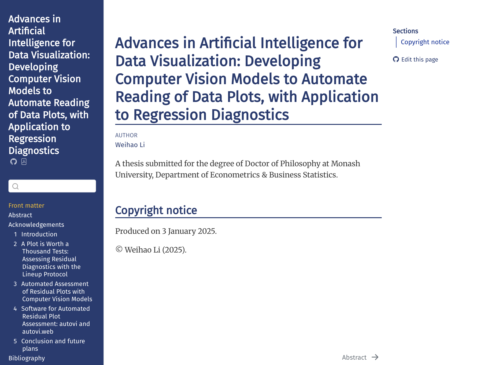
:::
::::


## Why residual plots matter — and why they're hard

After fitting a regression model, we plot the residuals to check our assumptions.

::: columns
::: {.column width="50%"}
**The problem:**

- Numerical tests (Breusch-Pagan, Shapiro-Wilk) are either insensitive or over-sensitive
- Visual inspection is effective but **subjective and unscalable**
- Different analysts reading the same plot reach different conclusions
:::
::: {.column width="50%"}
<br>
*"Does this pattern look like a problem, or is it just noise?"*
:::
:::

::: {.notes}
This is a problem every applied statistician knows. You look at a residual plot and ask: is that fan shape real, or am I seeing things? The answer depends on experience, the day of the week, and how tired you are. Patrick Li's thesis addresses this directly.
:::

## The lineup protocol: visual inference [(1/2)]{.f50}

::: {.panel-tabset}

## Example 1

:::: {.columns}
::: {.column width = "30%"}

```{r}
#| label: nullabor-mtcars
library(nullabor)

cars_lm <- lm(mpg ~ hp, data=mtcars)
cars_d <- mtcars |>
  mutate(.resid = residuals(cars_lm),
         .fitted = fitted(cars_lm))
# write_csv(cars_d, file="data/cars_d.csv")         

set.seed(320)
l1 <- lineup(null_lm(mpg ~ hp, method = "rotate"), 
       true = cars_d, n = 12)

cars_plt <- ggplot(l1, aes(x=hp, y=.resid)) +
  geom_point(alpha = 0.8) +
  facet_wrap(~.sample, ncol=4) +
  xlab("") +
  theme_few() +
  theme(axis.text = element_blank())

```

Which plot is the most different?

:::
::: {.column width="70%"}

```{r}
#| label: mtcars-plt
#| fig-width: 6
#| fig-height: 4.5
#| out-width: 80%
#| fig-align: center
#| echo: false
cars_plt
```
:::
::::

## without nulls

```{r}
#| label: nullabor-skewed1
#| fig-width: 3
#| fig-height: 2
#| out-width: 30%
#| fig-align: center

set.seed(332)
d <- tibble(.fitted = -rexp(n=84*12),
            .resid = rnorm(n=84*12),
            .sample = rep(1:12, 84))
# write_csv(d, file="data/sim_exp.csv")            

d |>
  dplyr::filter(.sample == 1) |>
  ggplot(aes(x=.fitted, y=.resid)) +
    geom_hline(yintercept = 0, colour = "red") +
    geom_point(alpha = 0.8) +
    theme_bw() +
    theme(axis.text = element_blank())
```

Is there a problem with the model fit? Like heteroskedasticity?

## with nulls

:::: {.columns}
::: {.column width = "30%"}

```{r}
#| label: nullabor-skewed2

sk_l <- ggplot(d, aes(x=.fitted, y=.resid)) +
  geom_hline(yintercept = 0, colour = "red") +
  geom_point(alpha=0.8) +
  facet_wrap(~.sample, ncol=4, scales="free") +
  theme_bw() +
  theme(axis.text = element_blank(),
        axis.title = element_blank())
```

All of these are null samples. There is no relationship between residuals and fitted.

Which one did I show you?

:::
::: {.column width="70%"}

```{r}
#| label: skew-plt
#| fig-width: 6
#| fig-height: 4.5
#| out-width: 80%
#| fig-align: center
#| echo: false
sk_l
```

:::
::::

:::

## The lineup protocol: visual inference [(2/2)]{.f50}

:::: {.columns}
::: {.column width="80%"}

The **`nullabor` package** provides a formal framework for reading plots.

::: {.incremental}

- Generate **null plots** by permuting or simulation under H₀
- H₀ is specified by the plot mappings, when using the grammar of graphics
- Embed the real plot in a lineup of decoys
- Ask: which plot is the most different?
- If it is the true data ($p < 0.05$, if num plots $= 20$), the pattern is statistically detectable
- The approach has been validated against conventional tests
- Provides significance testing in problems where there are no existing tests
:::

:::
::: {.column width="20%"}

{width="80%"}

:::
::::

<br><br>

::: {style="font-size: 70%;"}
Read more at [https://dicook.github.io/nullabor/](https://dicook.github.io/nullabor/)
:::


::: {.notes}
The lineup protocol is a beautifully simple idea. Instead of asking "is this pattern significant?" in the abstract, you ask: can I pick the real plot out of a crowd? If the real plot is distinctive, you can. If not, the pattern is within the range of chance. It grounds visual inference in a formal hypothesis testing framework.
:::

## From human judgement to computer vision

Train a computer vision model to **read residual plots the way a human would read lineups**.

<br>

1. Generate thousands of residual plots under known conditions: bad (various model misspecifications) and good (no violation of error assumptions)
2. Train a convolutional neural network on these synthetic plots
3. Validate against human subject experiment results
4. The model gets closer to **accuracy of human raters** — but at scale
5. Provides additional feedback of where image departs from a good residual plot

Prior to training, a large scale human subjects experiment was conducted using lineups to compare human performance relative to classical statistical tests (Breusch-Pagan for heteroskedasticityt, Shapiro-Wilk for non-normality). 


## The `autovi` package

```{r}
#| label: autovi
#| eval: false
library(autovi)

# Fit a model
mtcars_lm <- lm(mpg ~ wt + hp, data = mtcars)

# Automated residual plot assessment
result <- auto_vi(mtcars_lm)
result$p_value   # formal p-value from CV model
result$plot      # annotated residual plot
```

- Returns a **p-value** analogous to a formal hypothesis test
- Indicates **which type of departure** was detected (non-linearity, heteroscedasticity, etc.)
- But it requires installing python and tensorflow, so there is also available as a [**Shiny web app**](https://autoviweb.netlify.app/) for easy use.

## Example 1: Revisited

::: {.panel-tabset}

# Upload

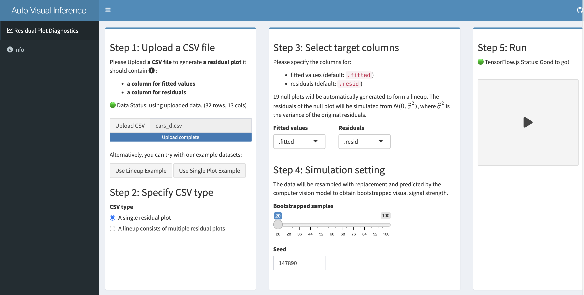{width="1300px"}

# Significance

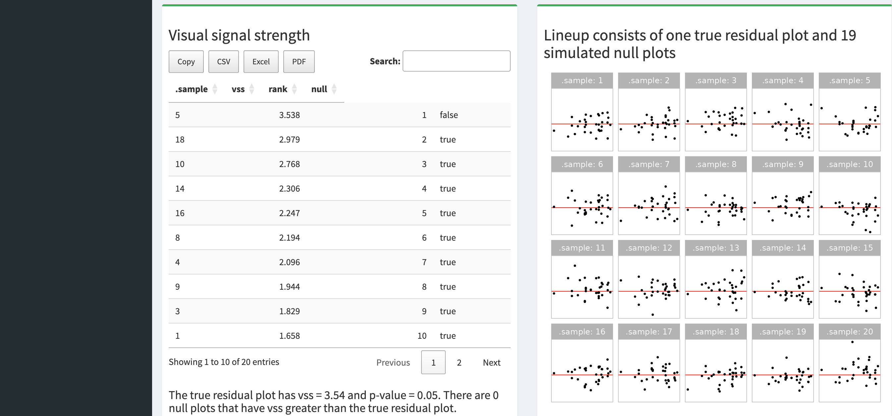{width="1300px"}

# Explanation

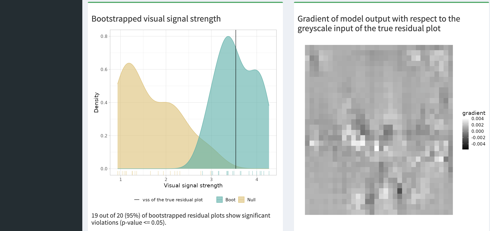{width="1300px"}

:::

## Example 2: Revisited

::: {.panel-tabset}

# Upload

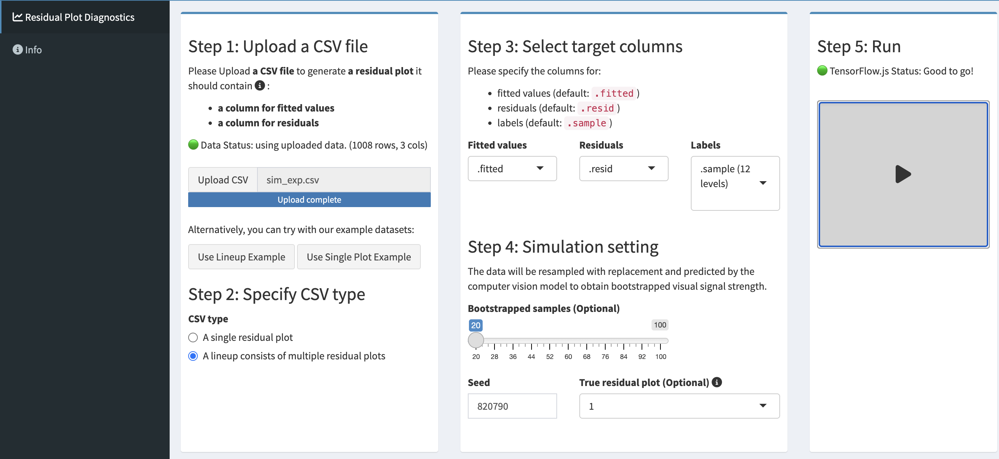{width="1300px"}

# Significance

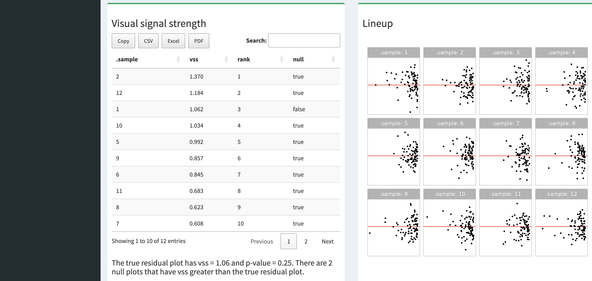{width="1300px"}

# Explanation

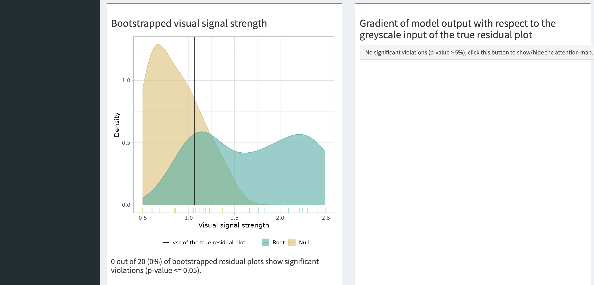{width="1300px"}

:::

## Key take-aways

- Use the **lineup protocol** to assess your interpretation of structure in a plot: Look at plots in the context of null samples, what might this look like if a sample consistent with no structure were shown.
- The computer vision model in the `autovi` software and associated shiny app can **help evaluate patterns in residual plots**. Especially useful for teaching introductory statistics.

## Part 3 {.center background-color="#2c3e50"}

:::: {.columns}
::: {.column width="70%"}

Exploring high-dimensional data with tours - you can see beyond 2D

- Customer segmentation with dozens of behavioural variables
- Financial risk models with many correlated inputs
- Supply chain data with multiple performance metrics per node
- Survey data with hundreds of items

:::
::: {.column width="30%"}

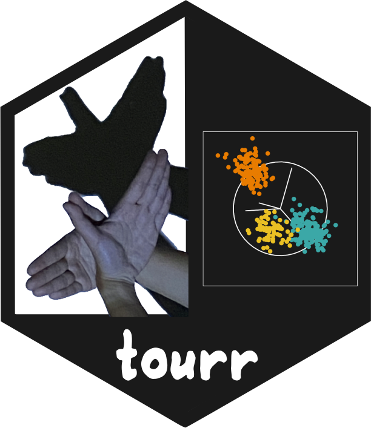{width="300px"}

:::
::::


## What is a "tour"?

:::: {.columns}
::: {.column width="60%"}

A **tour** is a continuous sequence of 2D projections of high-dimensional data — like slowly rotating a sculpture to see it from all angles.


::: {style = "font-size: 80%;"}

- **Grand tour**: random rotation through all projections
- **Guided tour**: steered toward projections with interesting structure
- **Radial tour**: to assess sensitivity of structure and variable importance
- **Slice tour**: sections through the data (for concave or hollow structure)
- **Sage tour**: reverses for the "crowding" effect of high dimensions projected to low dimensions (think central limit theorem, but in an undesirable way)

:::

:::

::: {.column width="40%"}

```{r}
#| label: tourr
#| eval: false
library(tourr)
data(penguins)

f_std <- function(x) (x-mean(x))/sd(x)
pinguino <- penguins |>
  dplyr::filter(!is.na(bill_len)) |>
  rename(bl = bill_len,
         bd = bill_dep,
         fl = flipper_len,
         bm = body_mass) |>
  select(bl:bm, species) |>
  mutate_if(is.numeric, f_std)      
animate_xy(pinguino[, 1:4], 
  #guided_tour(lda_pp(pinguino$species)),
  col = pinguino$species)

render_gif(pinguino[, 1:4],
  grand_tour(), 
  display_xy(col = pinguino$species),
  gif_file = "images/penguins_tour.gif",
  apf = 1/20,
  frames = 500)
```

{width="500px"}

:::
::::

## The `mulgar` book: a practical guide

::: {.column width="80%"}
**Cook & Laa (2026)** — *Interactively Exploring High-Dimensional Data and Models in R*: [dicook.github.io/mulgar_book](dicook.github.io/mulgar_book)
:::

::: {style="position: absolute; top: 10px; right: 10px;"}
{width=250px}
:::

<br>

Covers visualisation for:

::: columns
::: {.column width="50%"}
- Principal component analysis
- Non-linear dimension reduction (UMAP, t-SNE)
- Clustering (k-means, hierarchical, model-based, self-organised maps)
:::
::: {.column width="50%"}
- Supervised classification (linear discriminant analysis, trees, forests, SVMs, neural nets)
- Diagnostics for model fit
- Explainable AI (SHAP values)
:::
:::

## Example: Risk Taking [(1/2)]{.f50}

:::: {.columns}
::: {.column}
- Survey of 563 Australian tourists, see [Dolnicar S, Grün B, Leisch F (2018)](https://link.springer.com/book/10.1007/978-981-10-8818-6)
- Six different types of risks: recreational, health, career, financial, social and safety
- Rated on a scale from 1 (never) to 5 (very often)

<br>

Goal: *Conduct market segmentation to group tourists into similar behaviour.*


:::
::: {.column}

Step 1: understand the shape of the data 

```{r}
#| eval: false
# Step 1: get a sense of the data
library(lionfish)
data("risk")
colnames(risk) <- c("Rec", "Hea", "Car", "Fin", "Saf", "Soc")

animate_xy(risk)
set.seed(201)
render_gif(risk,
           grand_tour(),
           display_xy(col = "#6C26AC"),
           start = basis_random(6,2),
           gif_file = "images/risk_gt.gif",
           apf = 1/20,
           frames = 400,
           width = 400,
           height = 400)
```

::: {.panel-tabset}

## shape

::: {layout-ncol=2}

{fig-alt="Apple in two halves and knife on cutting board."}

{fig-alt="Banana cut into eight coin-shaped pieces and knife on cutting board."}

:::
## tour
<center>
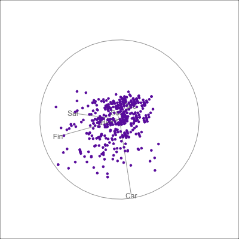{fig-alt="Animation showing 2D projections of 6D data as scatterplots of purple points. There is a circle with line segments radiating from the centre which represent the projection coefficients of each 2D projection shown. The patterns that can be seen are circular in many projections, and sometimes elongated, almost elliptical with some higher density at one end and lower density at the other. We can also see discrete lines of points which is due to each variable being ordinal: which can be ignored because it is not important structure for understanding the association between variables."}
</center>

## images

::: {layout-ncol=2}

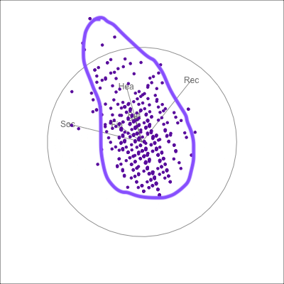{width=300 fig-alt="A single 2D projection of 6D data shown as a scatterplot of purple points. A purple sketch roughs out the shape, which is like a pear. The variables are mostly contributing to this projection Soc, Rec and Hea."}

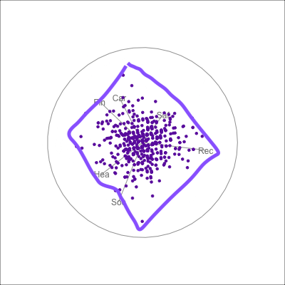{width=300 fig-alt="A single 2D projection of 6D data shown as a scatterplot of purple points. A purple sketch roughs out the shape, which is like a rhombus. All six variables contribute to this projection in different directions."}

:::

:::
:::
::::

## Example: Risk Taking [(2/2)]{.f50}

:::: {.columns}
::: {.column width="60%"}

```{r}
#| label: risk
#| eval: false
risk <- readRDS("data/risk_MSA.rds")
colnames(risk) <- c("Rec", "Hea", "Car", "Fin", "Saf", "Soc")
risk <- as.data.frame(risk)

risk_d <- apply(risk, 2, function(x) (x - mean(x)) / sd(x))

# Clustering
nc <- 5
set.seed(1145)
r_km <- kmeans(risk_d, centers = nc, iter.max = 500, nstart = 5)

r_km_d <- risk_d |>
  as_tibble() |>
  mutate(cl = factor(r_km$cluster)) |>
  bind_cols(model.matrix(~ as.factor(r_km$cluster) - 1))
colnames(r_km_d)[(ncol(r_km_d) - nc + 1):ncol(r_km_d)] <- paste0(
  "cluster",
  1:nc
)
r_km_d <- r_km_d |>
  mutate_at(vars(contains("cluster")), function(x) x + 1)

#animate_xy(r_km_d[, 1:6], col = r_km_d$cl)
#animate_xy(r_km_d[, 1:6], guided_tour(lda_pp(r_km_d$cl)), col = r_km_d$cl)

render_gif(r_km_d[, 1:6],
           guided_tour(lda_pp(r_km_d$cl)),
           display_xy(col = r_km_d$cl),
           start = basis_random(6,2),
           gif_file = "images/risk_cl5.gif",
           apf = 1/20,
           frames = 400,
           width = 400,
           height = 400)
```

::: {.panel-tabset}

## Number of clusters: 2

<center>
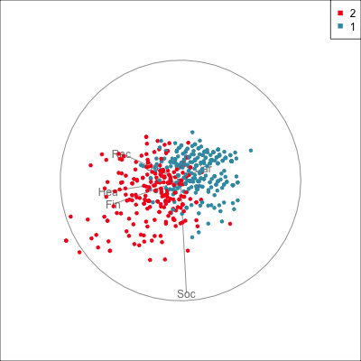{width="500px"}
</center>

## 3

<center>
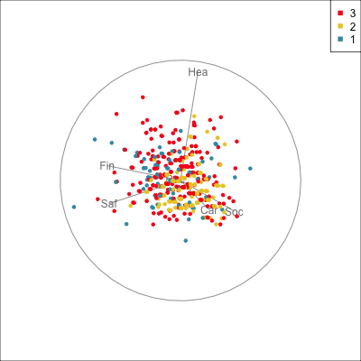{width="500px"}
</center>

## 4

<center>
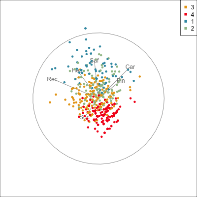{width="500px"}
</center>

## 5

<center>
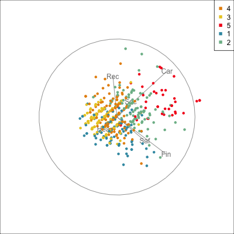{width="500px"}
</center>

:::
:::
::: {.column width="40%"}

<br><br>
Clustering by $k$-means, and to visualise we use a **guided tour** steering towards the projection that best separates the clusters.

<br>

- *How is the clustering dividing this data?*
- How many clusters would you use?

:::
::::

## Key takeaways: high-dimensional visualisation


- Tours let you explore structure that PCA and t-SNE *assume away*
- Connects directly to ML model diagnostics and XAI, making black boxes more transparent


## Putting it together {.center background-color="#2c3e50"}

## Three new methodology directions, one theme

> Better graphics → better decisions.

<br>

All three advances address a common problem: **our standard visualisations hide things we need to know**.

<br>

| Software/methodology | What it reveals |
|------|----------------|
| `ggdibbler` | Uncertainty in estimates and predictions |
| `nullabor` / `autovi` | Whether model assumptions are actually met |
| `tourr` / `mulgar` | Structure hidden in high dimensions |


## Resources

::: {style="font-size: 90%;"}
::: columns
::: {.column width="50%"}

**`ggdibbler`**  
[https://harriet-mason.github.io/ggdibbler/](https://harriet-mason.github.io/ggdibbler/)  

<br>

**`mulgar` book**  
[https://dicook.github.io/mulgar_book/](https://dicook.github.io/mulgar_book/) 

:::
::: {.column width="50%"}
**`nullabor`**  
[github.com/dicook/nullabor](https://dicook.github.io/nullabor/) 

<br>

**`autovi`**  
[https://autoviweb.netlify.app/](https://autoviweb.netlify.app/)
:::
:::

<br><br>

Slides made in [Quarto](https://quarto.org/), with code included.  

<br>

<a rel="license" href="http://creativecommons.org/licenses/by-sa/4.0/"></a><br />This work is licensed under a <a rel="license" href="http://creativecommons.org/licenses/by-sa/4.0/">Creative Commons Attribution-ShareAlike 4.0 International License</a>.

:::
